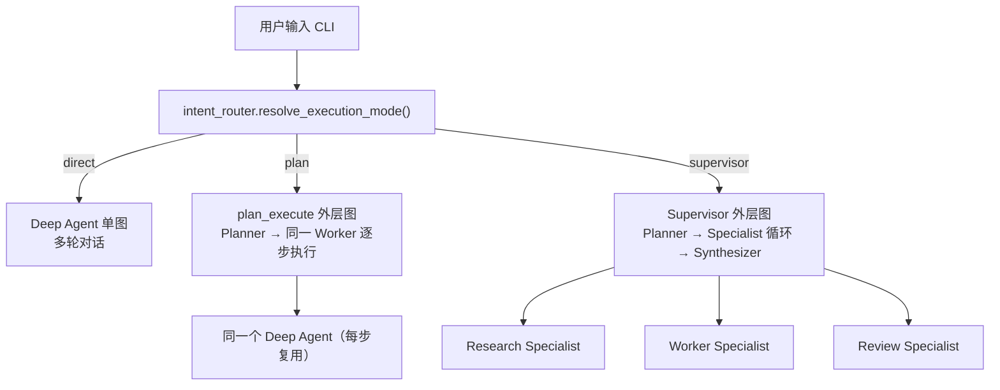
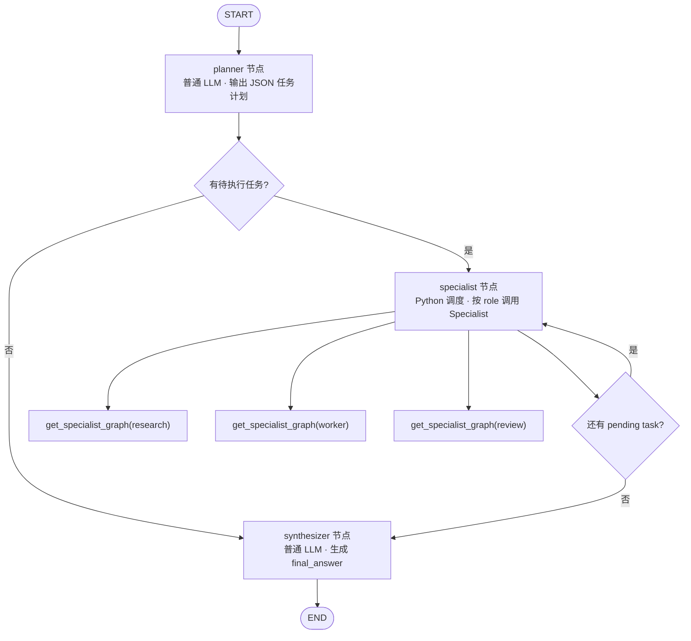
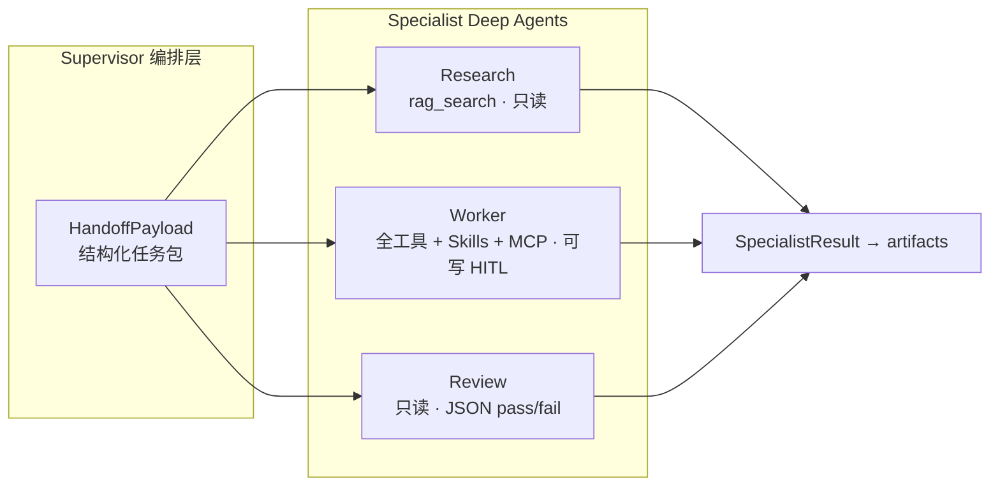
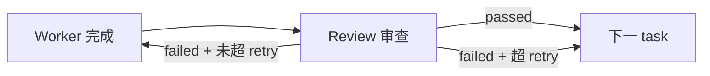
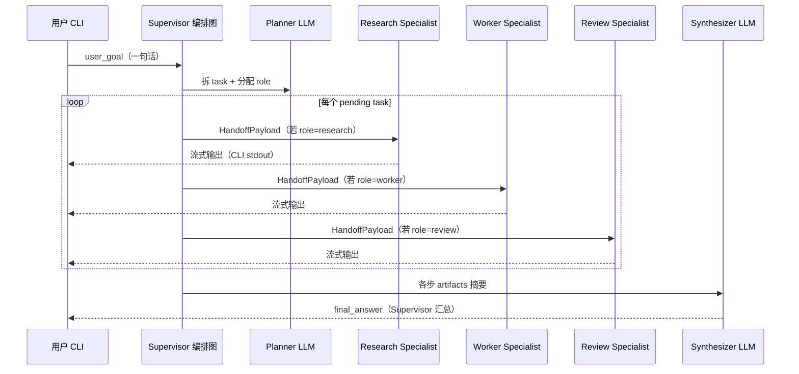
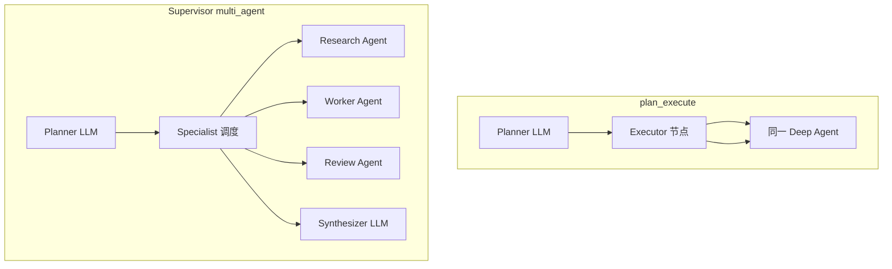

# Multi-Agent 架构说明（Supervisor 模式）

本文描述本项目中 **Supervisor 多智能体** 与 **plan 模式**、**直连 Deep Agent** 的关系，以及「Supervisor 是谁、谁对用户说话」等常见问题。

相关代码：

| 文件 | 说明 |
|------|------|
| [`supervisor.py`](./supervisor.py) | Supervisor 外层 LangGraph：Planner → Specialist 循环 → Synthesizer |
| [`specialists.py`](./specialists.py) | 按 role 编译 Research / Worker / Review Deep Agent |
| [`roles.py`](./roles.py) | 角色 prompt、工具白名单、文件系统权限 |
| [`handoff.py`](./handoff.py) | Supervisor ↔ Specialist 结构化 Handoff 契约 |
| [`config.py`](./config.py) | `ENABLE_MULTI_AGENT_ROUTING` 等环境变量 |
| [`../intent_router.py`](../intent_router.py) | CLI 路由：`direct` / `plan` / `supervisor` |
| [`../plan_execute.py`](../plan_execute.py) | plan 模式（保留，与 multi-agent 独立开关） |

---

## 核心结论（先读这段）

1. 本项目有 **三种执行模式**：`direct`（直连 Deep Agent）、`plan`（规划 + 同一 Worker 分步执行）、`supervisor`（多角色 Specialist 协作）。
2. **Supervisor 不是一个会聊天的 Deep Agent**，而是 **外层 LangGraph 编排图**（Planner 节点 + Specialist 调度逻辑 + Synthesizer 节点）。
3. **Research / Worker / Review** 才是带工具、带沙箱的 Specialist Deep Agent。
4. **最终面向用户的正式答复** 由 **Synthesizer** 生成；执行过程中 CLI 还会 **流式打印各 Specialist 的输出**。
5. Supervisor 宏任务使用 **独立 checkpointer 线程**，不写入用户主对话 thread。

---

## 一、整体架构：三种运行模式

CLI 入口（`agent_core.main`）在开启路由后，由 `intent_router.resolve_execution_mode()` 选择模式：



| 模式 | 环境变量 | 本质 |
|------|----------|------|
| **direct** | 默认（路由关闭或未命中） | 单张 Deep Agent 图，与用户 **多轮** 持续对话 |
| **plan** | `ENABLE_PLAN_ROUTING=1` | 外层 LangGraph：Planner 拆 todo → 每步调用 **同一个** Deep Agent |
| **supervisor** | `ENABLE_MULTI_AGENT_ROUTING=1` | 外层 LangGraph：Planner 拆 task 并分配 role → 调度 3 类 Specialist → Synthesizer 汇总 |

两种 advanced 模式 **可独立或同时开启**；同时开启时，路由 LLM 仅在 **已启用** 的模式中选择（见 `intent_router.py`）。

---

## 二、Supervisor 编排图内部结构

Supervisor 由 `build_supervisor_graph()` 编译（`supervisor.py`）：



### 三个节点分别是什么

| 节点 | 实现 | 是否 Deep Agent | 是否调工具 |
|------|------|-----------------|------------|
| **planner** | `build_chat_model()` + JSON 解析 | ❌ | ❌ |
| **specialist** | Python 函数 `specialist_node` + `_invoke_specialist` | ❌（调度层） | 间接（委派给 Specialist） |
| **synthesizer** | `build_chat_model()` + 读 `artifacts` | ❌ | ❌ |

因此：**Supervisor = 编排层（Orchestrator）**，不是第四个对话 Agent。

---

## 三、Specialist 角色边界

三类 Specialist 在 `roles.py` 定义，在 `specialists.py` 各编译 **一张独立 Deep Agent 图**（进程内按 role 缓存）：



| 角色 | 工具 | 文件权限 | 职责 |
|------|------|----------|------|
| **research** | `rag_search` | 全局只读 | 调研、引用来源 |
| **worker** | host tools + RAG + MCP + Skills | 沙箱可写（HITL） | 写文件、跑脚本、交付产物 |
| **review** | 无额外工具（Deep Agent 内置 read） | 全局只读 | 审查 Worker 产出，末尾输出 JSON `{passed, feedback, summary}` |

步骤间契约见 [`handoff.py`](./handoff.py)：`HandoffPayload`（下发）→ `SpecialistResult`（回传）。

---

## 四、Review 质量门与重试

Review 不通过时，Supervisor 将对应 **Worker 步骤重新置为 pending**（Review 也重新 pending），在 `SUPERVISOR_MAX_REVIEW_RETRIES` 预算内循环：



---

## 五、谁对用户说话？

要区分 **过程中** 与 **最终答复**：



| 阶段 | 谁输出 | 说明 |
|------|--------|------|
| 执行中 | **Research / Worker / Review** | `_invoke_specialist` 通过 `iter_assistant_text_sync` 流式打印到终端 |
| 任务结束 | **Synthesizer** | 打印 `--- Supervisor 汇总 ---`，写入 state `final_answer` |
| 主会话 thread | **Deep Agent（direct）** | supervisor 跑完后 `continue`，**不**把结果写回主 checkpointer |

**结论：**

- 正式、面向用户的 **最终总结** → **Synthesizer**（Supervisor 编排层的一部分）。
- **中间过程** → 各 Specialist 直接可见（当前 CLI 实现未做「后台静默」）。
- Supervisor **不与用户多轮对话**；一次 `run_supervisor_task` 跑完即返回 CLI 提示符。

---

## 六、Checkpoint / 线程隔离

| 层级 | thread_id 示例 | 用途 |
|------|----------------|------|
| 用户主对话 | `{user_id}__demo-thread-1` | direct 模式多轮 messages |
| plan 宏任务 | `{macro}:todo:{todo_id}` | plan 每步 Deep Agent |
| supervisor 宏任务 | `{macro}:task:{task_id}:{role}` | 每步 Specialist 独立轨迹 |

Supervisor 宏任务 id 默认：`{CLI_THREAD_ID}-supervisor` 或 `langgraph-supervisor -t` 指定。

多租户身份仍通过 `AgentContext` + `invoke_kwargs()` 注入，与单图多租户设计一致（见 [`../utility/agent_runtime_user_isolate.md`](../utility/agent_runtime_user_isolate.md)）。

---

## 七、与 plan 模式的对比



| 维度 | plan | supervisor |
|------|------|------------|
| 执行单元 | 同一 Worker（Deep Agent） | 按 role 不同 Specialist |
| 质量门 | 无 | Review + Worker 重试 |
| 最终汇总 | 无专门节点 | Synthesizer |
| 适用场景 | 多步但能力同质 | 调研 → 交付 → 审查 分角色流水线 |

---

## 八、启用方式

```bash
# .env
ENABLE_MULTI_AGENT_ROUTING=1   # CLI 自动路由到 Supervisor
ENABLE_PLAN_ROUTING=1          # CLI 自动路由到 plan（可并存）
SUPERVISOR_MAX_REVIEW_RETRIES=2

# 显式命令
langgraph-supervisor "调研 XXX，写总结并审查"
langgraph-plan "多步同质任务..."
langgraph-agent                  # 开启路由后自动分流；否则直连 Deep Agent
```

Web UI（`langgraph-ui`）当前 **已接入** plan / supervisor 自动路由（与 CLI 相同环境变量）；编排结果写入会话 messages，不合并进主 Deep Agent checkpointer thread。

---

## 九、包内文件职责速查

```
multi_agent/
├── muti_agent_archreadme.md   # 本文
├── config.py                  # ENABLE_MULTI_AGENT_ROUTING
├── roles.py                   # AgentRole + prompt/permissions
├── handoff.py                 # HandoffPayload / SpecialistResult
├── specialists.py             # build_specialist_graph(role)
└── supervisor.py              # build_supervisor_graph() + run_supervisor_task()
```

---

## 十、后续可演进方向（非当前实现）

若需更「企业前台」体验（仅 Supervisor 对用户可见、Specialist 全程后台）：

- Specialist 关闭 CLI 流式输出，只写 `artifacts`；
- 由 Synthesizer 或独立 **Supervisor Chat Agent** 统一对外回复；
- 可选：将 `final_answer` 写回用户主 thread，形成连续对话感。
