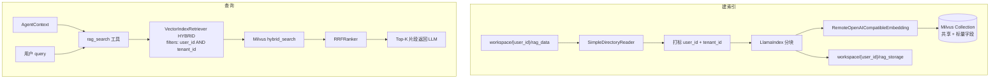
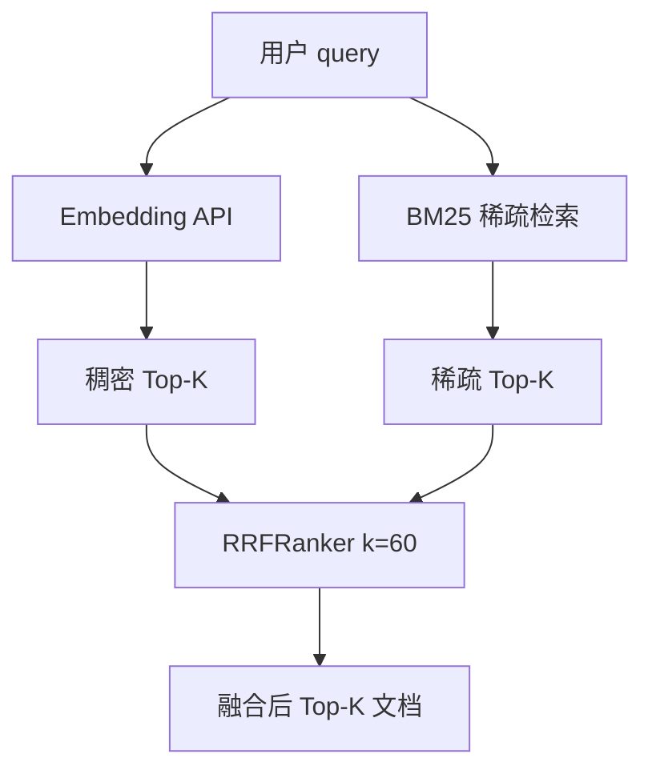

# RAG 知识库检索

本模块实现 Agent 可调用的知识库检索能力：**本机文档 + LlamaIndex 元数据 + 远程 Milvus 向量库 + 远程 Embedding 服务**，检索策略为 **稠密向量 + BM25 混合检索**，融合算法为 **RRF（Reciprocal Rank Fusion）**。

核心代码：`retriever.py`
对外入口：`_get_rag_retriever(user_id, tenant_id)`（按租户懒加载，进程内缓存）
Agent 工具：`rag_search(query, runtime)`（`agent_core.py`；从 `ToolRuntime[AgentContext]` 读取身份）

---

## 1. 架构概览

RAG 由三部分组成，**可分机部署**；身份隔离与项目其他模块一致，走 **`AgentContext`（`user_id` + `tenant_id`）**：

| 组件 | 默认路径 / 服务 | 存储内容 | 是否按用户分开 |
|------|-----------------|----------|----------------|
| 原始文档 | `workspace/{user_id}/rag_data/` | PDF、Markdown 等源文件 | ✅ 每用户独立目录 |
| LlamaIndex 元数据 | `workspace/{user_id}/rag_storage/` | `docstore.json`、`index_store.json` 等 | ✅ 每用户独立目录 |
| 向量与稀疏索引 | 远程 Milvus（`MILVUS_URI`） | 稠密 embedding + BM25 稀疏向量 + `user_id` / `tenant_id` 标量 | ⚠️ **共享 collection**，检索时 metadata 过滤 |

**兼容路径（仅 `default` 用户）：** 若 `workspace/default/rag_data` 为空，仍回退到 `var/data/`（`RAG_DATA_DIR`）；元数据同理可回退 `var/storage/`（`RAG_STORAGE_DIR`）。



**设计要点：**

- 向量与 BM25 数据在 **Milvus**（单 collection，多租户靠标量过滤）；LlamaIndex 图结构在 **每用户本地 storage**。
- 首次对该 `(user_id, tenant_id)` 调用 `rag_search` 时才初始化 retriever（懒加载），避免启动即连 Milvus / Embedding。
- Retriever 按 `(user_id, tenant_id)` 进程内缓存（`_RAG_RETRIEVERS`），同租户重复调用不会重复建索引。
- 用户无文档目录或目录为空时，`rag_search` 返回 `(no results)`，不中断 Agent。

### 1.1 身份隔离（与单图多租户一致）

与 [`../utility/agent_runtime_user_isolate.md`](../utility/agent_runtime_user_isolate.md) 中 **层 2 · context** 对齐：

| 环节 | 行为 |
|------|------|
| 身份来源 | `rag_search` 读 `runtime.context.user_id` / `tenant_id`（非 `config`） |
| 建索引 | 每个 chunk 写入 metadata + Milvus 标量 `user_id`、`tenant_id` |
| 检索 | `MetadataFilters` 强制 `user_id == … AND tenant_id == …`，不会命中其他用户向量 |
| 物理存储 | Milvus **不**按用户拆 collection；逻辑隔离靠 filter（企业多租户 RAG 常见做法） |

---

## 2. 端到端流程

### 2.1 索引构建（冷启动 / 无本地 storage）

触发条件：`workspace/{user_id}/rag_storage/` 中不存在完整的 `docstore.json` + `index_store.json`（`default` 用户可回退 `var/storage/`）。

1. **读文档**
   `SimpleDirectoryReader(rag_data_dir)` 扫描该用户目录；PDF 优先 `PyMuPDFReader`，否则 `PDFReader`。

2. **打标与建索引**
   `_stamp_docs_with_tenant(docs, user_id=…, tenant_id=…)` 后调用 `VectorStoreIndex.from_documents(...)`：
   - 对每个文本块调用 **Embedding API** 生成稠密向量；
   - 原文与 `user_id` / `tenant_id` 写入 Milvus 标量字段；
   - BM25 稀疏字段由 **Milvus 内置函数** 维护；
   - 节点元数据写入 Milvus + 该用户 LlamaIndex docstore。

3. **持久化**
   `index.storage_context.persist(rag_storage_dir)` 保存该用户的 LlamaIndex 元数据。

4. **Milvus collection**
   若 `RAG_FORCE_REBUILD=1`，创建 store 时 `overwrite=True`，会 drop 旧 collection 再建（schema 含 `user_id`、`tenant_id` 标量）。

### 2.2 索引加载（热路径）

触发条件：该用户本地 storage 完整，且 Milvus 中 collection 存在且 schema 一致。

1. `MilvusVectorStore(overwrite=False)` 连接共享 collection；
2. `StorageContext.from_defaults(vector_store=..., persist_dir=该用户 rag_storage)`；
3. `load_index_from_storage(sc, embed_model=...)` 恢复索引图；
4. **不会**重新读取该用户 `rag_data/`（除非 force rebuild）。

### 2.3 检索（每次 `rag_search`）

1. Agent 调用 `rag_search(query, runtime)`，`runtime.context` 提供 `user_id` / `tenant_id`；
2. `_get_rag_retriever(user_id, tenant_id).retrieve(query)`：
   - 对 query 调用 Embedding API → 稠密 query 向量；
   - `VectorIndexRetriever` 以 `VectorStoreQueryMode.HYBRID` + **tenant metadata filters** 查询 Milvus；
3. Milvus 执行 **hybrid_search**（见第 4 节），仅在该用户/租户标量范围内检索；
4. 结果格式化为带 `score`、`source`、`page` 的文本片段（单条最长 1200 字符）返回给 LLM。

---

## 3. 技术栈与模块说明

### 3.1 Embedding：`RemoteOpenAICompatibleEmbedding`

- 协议：OpenAI 兼容 `POST {EMBED_BASE_URL}/embeddings`
- 请求体：`{"model": EMBED_MODEL, "input": [...]}`
- 鉴权：`Authorization: Bearer {EMBED_API_KEY}`（可为 `dummy`）
- 默认模型：`bge-m3`，常见维度 **1024**（须与 `EMBED_DIM` 一致）

建索引与查询均走同一 embedding 模型；换模型后应 `RAG_FORCE_REBUILD=1` 重建。

### 3.2 向量库：`MilvusVectorStore`

依赖：`llama-index-vector-stores-milvus`、`pymilvus`
要求：**Milvus 2.4+**（hybrid search + RRFRanker）

当前配置（`retriever.py`）：

| 参数 | 值 | 说明 |
|------|-----|------|
| `enable_sparse` | `True` | 启用 BM25 稀疏检索 |
| `similarity_metric` | `MILVUS_METRIC`（默认 `IP`） | 稠密向量相似度：内积 |
| `hybrid_ranker` | `RRFRanker` | 混合检索融合 |
| `hybrid_ranker_params` | `{"k": MILVUS_RRF_K}` | RRF 平滑常数，默认 60 |
| `use_async_client` | `False` | 同步检索路径，避免部分环境异步客户端问题 |
| `scalar_field_names` | `user_id`, `tenant_id` | 多租户标量字段（VARCHAR） |
| `scalar_field_types` | `DataType.VARCHAR` × 2 | 与上对应，用于 Milvus filter |

**未显式配置 `index_config` 时的 LlamaIndex 默认索引：**

| 字段 | index_type | metric | 说明 |
|------|------------|--------|------|
| 稠密 embedding | **FLAT** | IP（或 `MILVUS_METRIC`） | 暴力精确检索，适合中小规模 |
| 稀疏 BM25 | **SPARSE_INVERTED_INDEX** | BM25 | 倒排 + BM25 打分 |

> **不是 IVF_FLAT。** 仓库内 `tests/integration/test_milvus.py` 的 IVF_FLAT 仅用于 Milvus 连通性测试，与 RAG 无关。
> 数据量增大后可自行传入 `index_config` / `search_config` 切换 IVF_FLAT、HNSW 等（需改 `retriever.py` 并通常配合 `RAG_FORCE_REBUILD=1`）。

#### FLAT vs IVF_FLAT

| 类型 | 原理 | 优点 | 缺点 |
|------|------|------|------|
| **FLAT**（当前默认） | 与全部向量算相似度后取 Top-K | 精确、实现简单 | 数据量大时延迟与内存压力高 |
| **IVF_FLAT** | 先聚类，只在最近 nprobe 个簇内检索 | 近似检索，更快 | 需调 nlist / nprobe，有精度–速度权衡 |

### 3.3 检索器：`VectorIndexRetriever`

```python
VectorIndexRetriever(
    index=index,
    similarity_top_k=RAG_TOP_K,  # 默认 8
    vector_store_query_mode=VectorStoreQueryMode.HYBRID,
    filters=MetadataFilters(
        filters=[
            MetadataFilter(key="user_id", value=user_id, operator=FilterOperator.EQ),
            MetadataFilter(key="tenant_id", value=tenant_id, operator=FilterOperator.EQ),
        ]
    ),
)
```

- **HYBRID**：同时走稠密 ANN + 稀疏 BM25，再由 RRF 融合。
- **filters**：每次检索强制租户边界；不同用户不会检索到彼此向量。
- 未使用 Cross-Encoder 等二阶段 reranker；RRF 仅融合两路检索排名。

---

## 4. 混合检索与 RRF 详解

### 4.1 两路检索

| 路径 | Milvus 字段 | 输入 | 擅长场景 |
|------|-------------|------|----------|
| 稠密 | `embedding`（FLOAT_VECTOR） | Query 的 embedding 向量 | 语义相似、改写、同义表达 |
| 稀疏 | sparse 字段（SPARSE_FLOAT_VECTOR） | Query 原文（BM25 内置函数） | 关键词、专有名词、精确匹配 |

每路各取 `similarity_top_k` 条候选，再进入融合。

### 4.2 RRF（Reciprocal Rank Fusion）

Milvus `hybrid_search` 使用 `RRFRanker(k)`，典型公式：

\[
\text{score}(d) = \sum_i \frac{1}{k + \text{rank}_i(d)}
\]

- `rank_i(d)`：文档 `d` 在第 *i* 路结果中的名次（从 1 起）；
- `k`：默认 **60**（`MILVUS_RRF_K`），越大则排名差异被拉平。

Milvus 还支持 `WeightedRanker`（稠密/稀疏加权），本项目选用 **RRFRanker**。



### 4.3 与「Cross-Encoder 重排」的区别

| 类型 | 本项目 | 典型 Cross-Encoder |
|------|--------|-------------------|
| 阶段 | 检索阶段多路融合 | 检索后再用模型对候选重打分 |
| 成本 | 低（Milvus 内完成） | 高（额外模型推理） |
| 精度 | 融合排名，无深度语义交互 | 对 query-passage 对逐对打分，往往更准 |

---

## 5. Agent 集成

### 5.1 `rag_search` 工具

定义于 `agent_core.py`：

- 签名：`rag_search(query: str, runtime: ToolRuntime[AgentContext])`；
- 从 `runtime.context` 解析 `user_id` / `tenant_id`，再 `_get_rag_retriever(...)`；
- 注册到 Deep Agent 的 `extra_tools`；
- Multi-Agent 模式下 **Research** 角色专用（`specialists.py` / `roles.py`）；
- System prompt（`memory/blocks.py`）提示：知识库问题应调用 `rag_search`。

返回格式示例：

```text
[1] score=0.82 source=/path/to/doc.pdf page=3
<片段正文，最多 1200 字符>
```

无该用户文档时返回 `(no results)`。

### 5.2 调用时机

- **不会**在每次用户消息时自动检索；
- 由 LLM 根据工具描述决定是否调用 `rag_search`；
- 知识库路径 **不经过** 沙箱 FS 工具，直接读 `workspace/{user_id}/rag_data/` + 共享 Milvus（带 filter）。

---

## 6. 环境变量

### 6.1 必需

| 变量 | 说明 | 示例 |
|------|------|------|
| `EMBED_BASE_URL` | Embedding 服务根 URL（含 `/v1`） | `http://host:8080/v1` |
| `EMBED_DIM` | 向量维度，须与模型一致 | `1024`（bge-m3） |
| `MILVUS_URI` | Milvus 地址 | `http://host:19530` |

### 6.2 常用可选

| 变量 | 默认 | 说明 |
|------|------|------|
| `EMBED_API_KEY` | `dummy` | Embedding 鉴权 |
| `EMBED_MODEL` | `bge-m3` | Embedding 模型名 |
| `MILVUS_TOKEN` | 空 | Milvus 鉴权 |
| `MILVUS_COLLECTION` | `rag_llamaindex` | Collection 名 |
| `MILVUS_METRIC` | `IP` | 稠密相似度：IP / L2 / COSINE |
| `MILVUS_RRF_K` | `60` | RRF 参数 k |
| `RAG_TOP_K` | `8` | 返回条数 |
| `RAG_DATA_DIR` | `var/data` | **legacy**：`default` 用户回退源文档目录 |
| `RAG_STORAGE_DIR` | `var/storage` | **legacy**：`default` 用户回退 LlamaIndex 元数据 |
| `RAG_FORCE_REBUILD` | `0` | `1` = 删该用户本地 storage + drop Milvus collection 后重建 |
| `RAG_TRACE` | `0` | `1` = 输出 `[RAG_TRACE]` 耗时日志 |
| `AGENT_USER_ID` / `AGENT_TENANT_ID` | `default` | 与 Agent 身份一致；RAG 检索 filter 同源 |

每用户文档与元数据默认路径（无需 env）：`workspace/{user_id}/rag_data/`、`workspace/{user_id}/rag_storage/`（见 `utility/paths.py`）。

完整示例见项目根目录 `.env.example`。

---

## 7. 运维与排错

### 7.1 首次使用

**单租户 / CLI（`AGENT_USER_ID=default`）——兼容旧路径：**

```bash
mkdir -p var/data
# 将 PDF / 文档放入 var/data/
# 配置 .env 中 EMBED_*、MILVUS_*
make run-ui   # 或 make run-agent
# 首次 rag_search 时自动建索引
```

**多用户 / Web UI（每浏览器 `ui-<id>`）：**

```bash
mkdir -p workspace/ui-abc123/rag_data
# 将文档放入该用户 rag_data/
make run-ui
```

- 每用户 `rag_data` / `rag_storage` 在首次 Agent 调用时会由 `ensure_agent_workspace_dirs` 创建目录；**有文件才会建索引**。
- `default` 用户若 `workspace/default/rag_data` 为空，仍可读 `var/data/`。
- Docker 内访问宿主机 Embedding：`EMBED_BASE_URL=http://host.docker.internal:8080/v1`
- 容器内 **勿** 用 `127.0.0.1` 指 Milvus（应填远程或 compose 服务名）。

### 7.2 重建索引

以下情况建议 `RAG_FORCE_REBUILD=1` 后重启进程：

- 更换 `EMBED_MODEL` 或 `EMBED_DIM`；
- Milvus collection schema 变更（如从无 sparse 升级到有 sparse，或**升级后新增 `user_id`/`tenant_id` 标量**）；
- 本地 storage 与 Milvus 数据不一致；
- 大幅更新某用户 `rag_data/` 且希望全量重扫。

流程：删除该用户 `rag_storage/`（或 legacy `var/storage/`）→ Milvus `overwrite=True` drop collection → 重新 `from_documents`（带 tenant 打标）。

### 7.3 调试

```bash
RAG_TRACE=1 make run-agent
```

日志包含：Embedding 耗时、`SimpleDirectoryReader`、`from_documents` / `load_index_from_storage`、retriever 初始化总耗时。

### 7.4 常见问题

| 现象 | 可能原因 |
|------|----------|
| `请在 .env 设置 EMBED_BASE_URL` | 未配置 Embedding |
| `请设置 EMBED_DIM` | Milvus 建库需要维度 |
| `rag_search` 返回 `(no results)` | 该用户 `rag_data` 无文件或未建索引 |
| hybrid search 报错 | Milvus < 2.4 或 pymilvus 过旧 |
| 检索结果空 | collection 为空、filter 无匹配，或未 load；检查 Milvus 与标量字段 |
| 升级后 default 用户也检索不到 | 旧 collection 无 `user_id` 字段，需 `RAG_FORCE_REBUILD=1` |
| PDF 乱码 / 二进制 | 未安装 `llama-index-readers-file pymupdf` |

---

## 8. 依赖包

```text
llama-index-core
llama-index-vector-stores-milvus>=0.9.0
pymilvus
llama-index-readers-file   # PDF
pymupdf                    # 推荐 PDF 解析
requests                   # Embedding HTTP 客户端
```

---

## 9. 源码索引

| 文件 | 职责 |
|------|------|
| `rag/retriever.py` | Embedding、Milvus、索引 build/load、Hybrid retriever、租户 filter |
| `rag/__init__.py` | 导出 `_get_rag_retriever` |
| `agent_core.py` | `rag_search` 工具（`ToolRuntime[AgentContext]`） |
| `utility/paths.py` | `resolve_rag_data_dir`、`resolve_rag_storage_dir`；legacy `RAG_DATA_DIR` |
| `utility/agent_policy.py` | 创建 workspace 时一并创建 `rag_data` / `rag_storage` |
| `utility/agent_runtime_user_isolate.md` | 单图多租户与 RAG 身份链路说明 |
| `multi_agent/specialists.py` | Research 角色挂载 `rag_search` |

---

## 10. 扩展方向（未实现）

- 稠密索引从 FLAT 升级为 **IVF_FLAT / HNSW**（`index_config` + `search_config`）；
- 检索后增加 **Cross-Encoder reranker**（如 bge-reranker）；
- 自定义分块策略（chunk size、overlap）；
- 增量更新文档（当前以全量 rebuild 为主）；
- 使用 `WeightedRanker` 调节稠密/稀疏权重。
