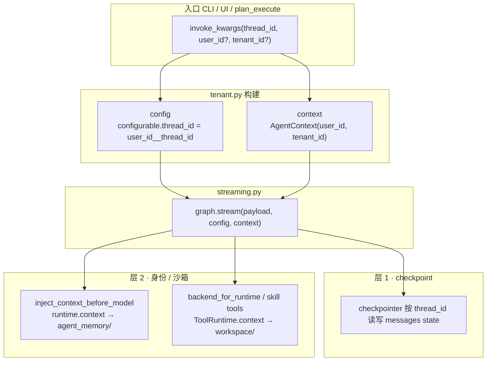

# 单图多租户：config 与 context 的两层隔离

本文说明本项目中 **会话隔离**（checkpoint）与 **身份 / 沙箱 / 记忆隔离**（context）如何分工，以及 `user_id`、`thread_id` 从入口传到 middleware 与工具的完整链路。

相关文件：

| 文件 | 说明 |
|------|------|
| [`agent_runtime.py`](./agent_runtime.py) | 应用层 `AgentRuntime`：`graph` 单例 + `invoke_kwargs()` |
| [`tenant.py`](./tenant.py) | `AgentContext`、`build_invoke_kwargs()`、thread 命名空间 |
| [`agent_policy.py`](./agent_policy.py) | `resolve_agent_scope()`、`backend_for_runtime()` |
| [`memory/context.py`](../memory/context.py) | `inject_context_before_model` middleware |
| [`streaming.py`](./streaming.py) | `graph.stream(..., config=, context=)` 调用点 |
| [`agent_core.py`](../agent_core.py) | `build_agent_graph()`、`context_schema=AgentContext` |

---

## 核心结论（先读这段）

本项目采用 **单图多租户**：进程内只编译一张 `graph`，所有用户 / 会话共用。隔离不靠多张图，而靠每次 `stream` / `invoke` 传入的两套参数：

| 层 | 载体 | 主要隔离什么 | 谁消费 |
|----|------|--------------|--------|
| **层 1** | `config` | 对话历史（checkpoint） | LangGraph checkpointer |
| **层 2** | `context`（`AgentContext`） | 工作区沙箱、长期记忆、技能执行边界 | middleware、工具、`backend_for_runtime` |

**`user_id` 不会单独传给 middleware 或工具**；它包在 `AgentContext` 里，经 `context=` 交给 LangGraph，框架注入 `Runtime.context` / `ToolRuntime.context` 后，业务代码通过 `runtime.context.user_id` 读取。

---

## 三种「Runtime」不要混

| 名称 | 来源 | 谁创建 | 用途 |
|------|------|--------|------|
| **`AgentRuntime`** | 本仓库 `utility/agent_runtime.py` | `get_agent_runtime()` | 持有 compiled `graph`，提供 `invoke_kwargs()` |
| **`Runtime[AgentContext]`** | LangGraph `langgraph.runtime` | 图执行时框架自动注入 | middleware（如 `before_model`） |
| **`ToolRuntime[AgentContext]`** | LangGraph `langgraph.prebuilt.tool_node` | tools 节点执行每个 tool call 时构造 | 自定义工具、`backend_for_runtime` |

---

## 总览：一次调用的数据流



---

## 层 1：会话 / checkpoint 隔离（`config`）

### 作用

- 持久化 **多轮对话的 `messages` state**（本项目用 checkpointer）。
- 不同 **会话**（`thread_id`）→ 不同对话历史。
- 不同 **用户** 即使用相同裸 `thread_id`，也不会串 checkpoint（有 `user_id` 前缀）。

### 构建过程

入口调用（示例 CLI）：

```python
runtime = get_agent_runtime()
invoke = runtime.invoke_kwargs(thread_id="demo-thread-1")  # user_id / tenant_id 可省略
config = invoke["config"]
```

`invoke_kwargs()` → `build_invoke_kwargs()` → `build_agent_config()`，生成：

```python
{
    "configurable": {
        "thread_id": "default__demo-thread-1",   # namespaced：{user_id}__{thread_id}
        "user_id": "default",
        "tenant_id": "default",
    }
}
```

`thread_id` 命名规则见 `tenant.namespaced_thread_id()`：分隔符为 `__`（`THREAD_NS_SEP`）。

### 传递与消费

```python
# streaming.py
for chunk in graph.stream(payload, config=config, context=context, ...):
    ...
```

LangGraph checkpointer 以 `config.configurable.thread_id` 为键读写 state。同一 `thread_id` 的多轮对话会接上历史；换 `thread_id` 即新会话。

`config.configurable` 里的 `user_id` / `tenant_id` 是 **辅助副本**（便于 `user_id_from_config()` 反查），**不是**沙箱隔离的主路径。

### 默认值

| 字段 | 未显式传入时 |
|------|----------------|
| `thread_id` | 由调用方传入（CLI：`THREAD_ID` 环境变量或 `demo-thread-1`） |
| `user_id` | `AGENT_USER_ID` 环境变量，默认 `"default"` |
| `tenant_id` | `AGENT_TENANT_ID` 环境变量，默认 `"default"` |

---

## 层 2：身份 / 沙箱 / 记忆隔离（`context`）

### 作用

- **`user_id`** → 决定磁盘路径：
  - 工作区：`workspace/{user_id}/`
  - 长期记忆：`workspace/{user_id}/agent_memory/`
  - 用户 skills：`workspace/{user_id}/skills/`
- **`tenant_id`**：租户标签，默认 `"default"`；当前主要用于 `AgentContext` 标识，路径解析以 `user_id` 为主。

### 构建过程

与 `config` 同一次 `build_invoke_kwargs()` 产出：

```python
context = invoke["context"]
# AgentContext(user_id="default", tenant_id="default")
```

`user_id` 解析链：`None` → `normalize_user_id()` → `get_agent_user_id()` → 环境变量 `AGENT_USER_ID` 或 `"default"`。

图编译时声明 context 类型（`agent_core.py`）：

```python
create_deep_agent(
    ...
    context_schema=AgentContext,
)
```

### 传递：从 `stream` 到 `runtime.context`

```python
graph.stream(payload, config=config, context=context)
```

LangGraph 将传入的 `context` 对象挂到框架 **`Runtime.context`** 上（类型为编译时声明的 `AgentContext`）。middleware 签名示例：

```python
@before_model(name="enterprise_context_layers")
def inject_context_before_model(
    state: AgentState, runtime: Runtime[AgentContext]
) -> dict[str, Any] | None:
    scope = resolve_agent_scope(runtime.context)  # ← user_id 在这里
    return apply_context_layers(dict(state), mem_dir=scope.memory_dir)
```

**没有**单独的 `user_id` 参数；`runtime.context` 就是当初 `stream(..., context=AgentContext(...))` 传入的整包对象。

### 消费：`resolve_agent_scope`

`agent_policy.resolve_agent_scope(ctx)` 根据 `ctx.user_id` 解析资源边界：

| 字段 | 路径 / 含义 |
|------|-------------|
| `workspace` | `workspace/{user_id}/` |
| `memory_dir` | `workspace/{user_id}/agent_memory/` |
| `skill_exec` | 脚本路径解析（`system-skills/` vs `skills/`） |

### 工具侧：`ToolRuntime.context` 同源

LLM 触发工具后，tools 节点为每个 tool call 构造 `ToolRuntime`，其中：

```text
ToolRuntime.context = Runtime.context   # 与 middleware 同源
```

文件沙箱工厂（`agent_policy.backend_for_runtime`）：

```python
def backend_for_runtime(runtime: ToolRuntime[AgentContext]) -> BackendProtocol:
    scope = resolve_agent_scope(runtime.context)
    return build_agent_backend(scope.context.user_id)
```

自定义工具（如 `workspace_exec_python`）同样在参数里声明 `runtime: ToolRuntime[AgentContext]`，读 `runtime.context` 解析沙箱。

`backend_for_runtime` 在 **编译图时** 作为工厂注册给 `create_deep_agent(backend=...)`；**执行工具时** 框架才传入 `ToolRuntime` 并调用。

---

## 两层如何配合：同一用户、两个会话

假设 `user_id=alice`，开两个会话 `thread_id=chat-a` 与 `chat-b`：

| 维度 | chat-a | chat-b | 是否共享 |
|------|--------|--------|----------|
| checkpoint 键 | `alice__chat-a` | `alice__chat-b` | 否（对话历史分开） |
| `context.user_id` | `alice` | `alice` | 是 |
| 工作区 / 记忆目录 | `workspace/alice/` | `workspace/alice/` | 是（同一沙箱与 agent_memory） |

因此：

- **换 `thread_id`**：新会话，checkpoint 隔离，沙箱与记忆仍属同一用户。
- **换 `user_id`**：新沙箱、新记忆目录；即使用相同 `thread_id` 字符串，checkpoint 键也因前缀不同而隔离。

---

## 各入口如何传参

### CLI（`agent_core.main`）

```python
invoke = runtime.invoke_kwargs(thread_id=thread_id)
# 仅传 thread_id；user_id / tenant_id 走环境变量默认值
```

指定用户：`AGENT_USER_ID=alice langgraph-agent`

### Web UI（`frontend/app.py`）

```python
invoke_kwargs(
    thread_id=active["thread_id"],
    user_id=active.get("user_id") or _resolve_ui_agent_user_id(),
)
```

未设 `AGENT_USER_ID` 时，每个浏览器分配 `ui-<uuid>` 作为 `user_id`。

### 规划执行（`plan_execute.py`）

```python
invoke_kwargs(thread_id=f"{macro}:todo:{tid}", user_id=normalize_user_id())
```

---

## 端到端时序（简化）

```text
1. get_agent_runtime()           # 懒编译单例 graph（无租户绑定）
2. invoke_kwargs(...)            # 构建 config + AgentContext
3. stream_assistant_text / graph.stream(..., config, context)
4. [层 2] before_model:
       Runtime.context → resolve_agent_scope → 读 agent_memory/*.md
5. agent 节点: LLM 推理 → 可能产生 tool_calls
6. [层 1] checkpointer: 按 config.thread_id 加载/保存 messages
7. [层 2] tools 节点:
       ToolRuntime.context → backend_for_runtime → workspace/{user_id}/
8. 循环直至本轮结束
```

---

## 常见误区

1. **「`config` 里的 `user_id` 驱动沙箱」** — 不对。沙箱与记忆走 **`context`**（`runtime.context.user_id`）。
2. **「每个用户一张图」** — 不对。全进程 **一张图**，靠每次调用的 `config` + `context` 隔离。
3. **「middleware 要单独传 `user_id`」** — 不对。只传 `AgentContext`，框架注入 `Runtime[AgentContext]`。
4. **「`AgentRuntime` 就是 LangGraph 的 `Runtime`」** — 不对。前者是应用层包装（持图 + 拼参数），后者是图执行时框架注入的运行时上下文。

---

## 扩展阅读

- 流式调用与 chunk 结构：[`streaming.md`](./streaming.md)
- 模块内联注释：[`agent_runtime.py`](./agent_runtime.py) 文件头 docstring
